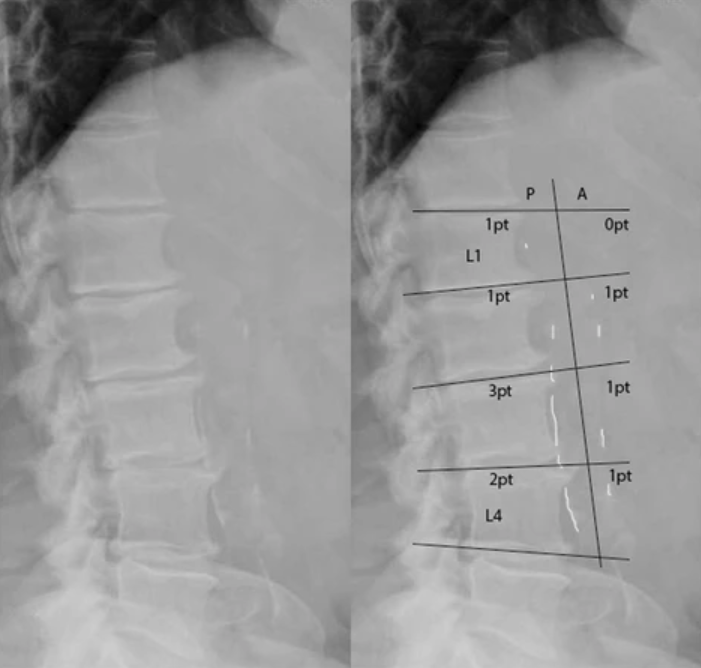

# Scoring of the abdominal aortic calcification

This repository automates the abdominal aortic calcification scoring of the DEXA images in the UKBB dataset. The scoring is based on the scheme shown below (from [this](https://bmcnephrol.biomedcentral.com/articles/10.1186/s12882-017-0480-2) reference paper).



Given a folder full of DEXA images from the UKBB dataset (after the images have been converted to png format from the DICOM format), the code can be run to generate scores only using model_1 (U-net for segmentation + aortic region extraction + regression for scoring), only using model_2 or to generate ensemble scores from model_1 and model_2.

## Getting started
The recommended build environment for the code is to have [Anaconda](https://docs.anaconda.com/anaconda/install/) installed and then to create a conda environment for python 3 as shown below:

```
conda create -n aac python=3.6.8
```

Once created, activate the environment and install all the needed libraries as follows: 

``` 
conda activate aac
pip install -r requirements.txt
```

## Running the code
Once the environment is setup and the DEXA images (png) are available in a folder, the ensemble scores using model_1 and model_2 can be computed with a simple inference call as follows:

```
python get_ensemble_scores.py --img_dir=<absolute path to folder containing DEXA images>
```

The ensemble scores are output in a csv file called 'predicted_aac_scores_ensemble.csv' in the same folder as that containing the DEXA images.

**Note**
Note This repository only contains the code, not the imaging data. To know more about how to access the UK Biobank imaging data, please go to the [UK Biobank Imaging Study website](http://imaging.ukbiobank.ac.uk/). Researchers can [apply](http://www.ukbiobank.ac.uk/register-apply/) to use the UK Biobank data resource for health-related research in the public interest.
