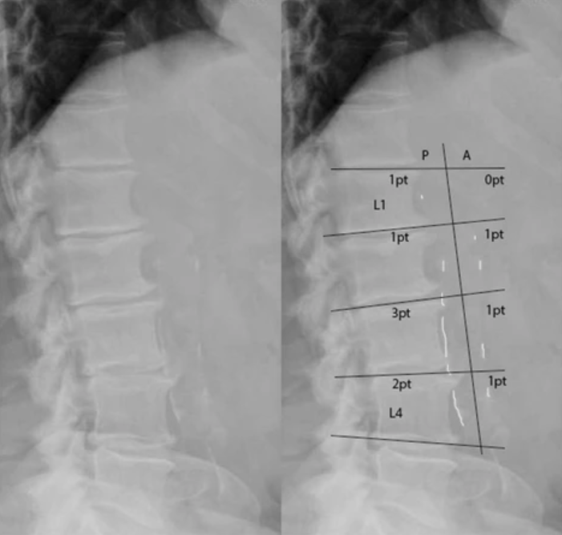

# AAC_scoring

This repository automates the abdominal aortic calcification scoring of the DEXA images in the UKBB dataset. The scoring is based on the scheme shown below (from [this](https://bmcnephrol.biomedcentral.com/articles/10.1186/s12882-017-0480-2) reference paper).



## Inference

Given a folder full of DEXA images from the UKBB dataset (after some postprocessing steps - clarify with Anurag before publishing), the code can be run to generate scores only using model_1 (U-net for segmentation + aortic region extraction + regression for scoring) or to generate ensemble scores from model_1 and model_2.

### Mode 1
In this mode, only model_1 scores are computed for the images in the folder. A sample inference call is as follows:

```
python predict_aac_scores.py --img_dir=<absolute path to folder containing DEXA images> --model_file_segmentation=<absolute path to segmentation model file> --model_file_regression=<absolute path to regression model file> --visualize=False
```

First, the images are segmented and the extracted Aortic regions are extracted to a sub-folder called 'aortic_regions' within the folder containing the DEXA images. Next, the regression model runs on these extracted regions to generate a csv file called 'predicted_aac_scores_model1.csv' in the main folder containing the DEXA images. A sample extract from the CSV file looks like the image below.

img_name | predicted_score
--- | --- 
4378704.png | 1.12
1996028.png | 3.15
4223931.png | 1.46
3078562.png | 1.92
4268644.png | 0.32

If ```--visualize=True```, then a segmentations image similar to the one shown below is saved for every image that is segmented and whose aortic region is extracted. In the image below, the subplots show - vertebrae segmentations + curve joining their centroids, pelvis segmentation + centroid, spinal curve + aortic region parallel to the curve, binary mask for the aortic region - from left to right in that order.


### Mode 2
In this mode, the ensemble scores for model_1 and model_2 are computed for the images in the folder. A sample inference call is as follows:

```
python get_ensemble_scores.py --img_dir=<absolute path to folder containing DEXA images>
```

In this mode, model_1 is called as described in Mode 1 and then model_2 is called to generate another csv file with calcification scores for each image. The 2 scores are averaged and a csv file with the ensemble scores called 'predicted_aac_scores_ensemble.csv' is output in the main folder containing the DEXA images.


## Training
The training routines for Model_1 are described below.

### Segmentation
The segmentation is based on a 3-class U-Net architecture - pelvis, vertebrae and background. In order to train the segmentation model, the training images are stored as pngs and the masks are stored as tif stacks where each channel represents the binary mask for one output class. A sample mask stack is shown below. The masks correspond to the background class, the vertebrae class and the pelvis class from left to right respectively.


The training routine is called as shown below from within the segmentation folder:

```
python train_unet.py --img_dir=<absolute path to folder of DEXA png images> --masks_dir=<absolute path to folder of tif stacks of masks for png images> --logs_dir=<absolute path to where the model files and checkpoints should be stored>
```

Refer to the list of FLAGS in train_unet.py to change other hyperparameters or the network architecture.

### Regression
The regression model is trained on the aortic regions that are extracted from the DEXA images after segmentation. The ground truth calcification scores need to be stored as csv file containing the name of the original DEXA image and the annotator's scores as the 2 columns. The training routine is called as shown below from the regression folder:

```
python train_regression.py --data_root=<absolute path to folder of extracted aortic regions from DEXA png images> --gt_csv_file=<name of GT csv file in data_root> --logs_dir=<absolute path to where the model files and checkpoints should be stored>
```

Refer to the list of FLAGS in train_regression.py to change other hyperparameters or the network architecture.


