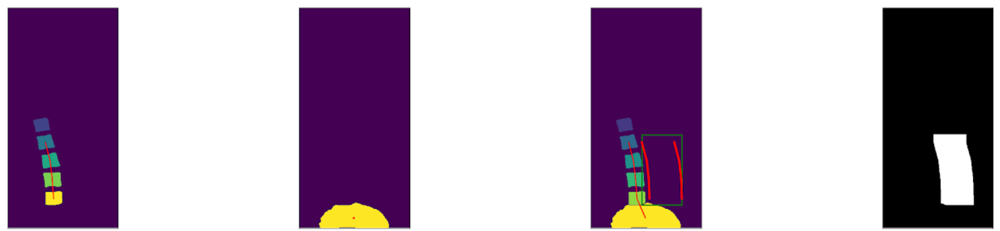
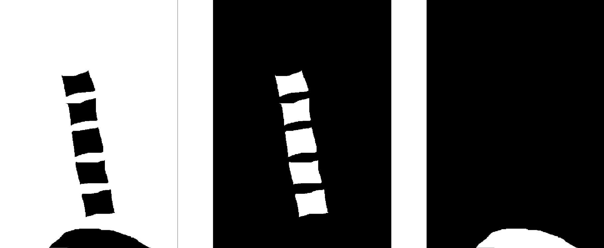

# Scoring of the abdominal aortic calcification

Given a folder full of DEXA images from the UKBB dataset (after the images have been converted to png format from the DICOM format), the code can be run to generate scores only using model_1 (U-net for segmentation + aortic region extraction + regression for scoring) or to generate ensemble scores from model_1 and model_2.

Model 1 estimates AAC scores via the following 3 steps:

1. Segmentation of the lower spine region.
2. Localization of the Aortic region using a spine-curve fitting method.
3. Regression on the localized region to map the calcification levels to a score in the standard range.

### Segmentation of the lower spine

In order to localize the region of the DEXA scan corresponding to the Aorta, correct anatomic locations of the Pelvis (P) and 4 vertebrae (L3-L5, S1) are needed. The network to achieve the necessary segmentation is based on a U-Net architecture. The grayscale DEXA image is fed to the input layer while at the final layer a 1x1 convolution is used to map each 16-component feature vector to one of 3 classes - spine, pelvis or background. 

The UKBB dataset has a total of 31,494 DEXA scans of patients available to score. Of those, 200 images were randomly chosen for annotations of P and L3-L5, S1. The png images of the scans were loaded on an open sourced annotation tool, [QuPath](https://qupath.github.io/), and the relevant anatomical locations were marked using the polygon tool. The user annotations were converted to binary masks for the 3 classes - Pelvis, vertebrae and background . Of the 200 images, 175 were used for training and cross-validation while the rest were reserved as an unseen test set to quantify the segmentation performance. 

Simple data augmentations in the form of crop and zoom, left-right flips and slight rotations (upto +/- 10 degrees) are used to augment the images in the training dataset. The network was trained with the multi-class cross-entropy loss using an Adam optimizer. The evaluation metric is the mean IoU for each of the 3 classes.

### Localization of the Aortic region

Once the segmentations of P and L3-L5, S1 are completed, the aortic region is localized and extracted via the following steps:

1. Run the segmentations through post-processing steps to:
  a. Eliminate false positives for P (determined through co-localization with L3-L5, S1).
  b. Fix broken or missing vertebrae using median height and width estimates for the different vertebrae
2. Determine the centroids of each of L3, L4, L5, S1 and P. Fit a spline curve to pass through each of these points to determine the spinal curvature
3. Along the spinal curvature, move to the right by a fixed offset Aoff and extract a retangular region whose width is Awidth and whose height is determined by the vertical distance between the centroids of L3 and P. Crop and/or pad the images to be of size 196x196 pixels.

At the output of this step, the Aortic regions will be localized and extracted from the original CT images. These regions are then passed on to the Regression module to be converted into a calcification score.

### Regression

The final step in translating the DEXA images to a calcification score is to run a regression model that maps the extracted aortic regions to a score. 

Of the 1300 user annotated calcification levels, 1000 images were used for training and cross-validation while the other 300 were held out as an unseen test set. The ground truth data is highly skewed towards the lower calcification scores creating a high degree of data imbalance. In order to introduce some degree of balance, the dataset was augmented in a stratified manner. Augmentation routines include horizontal and vertical flips, random rotations, zoom and crop, random brightness changes, random contrast changes as well as random hue changes. During agile augmentation, images with higher scores were augmented with different combinations of the routines to produce as many as 32 variations of every image while images with lower calcification scores were augmented only once or not at all.

During training, the regression model used a weighted mean squared error metric wherein errors in the higher calcification scores were weighted higher than those in the lower scores, once again with the intention of offsetting the high degree of skew in the ground truth score distributions. The network is trained with an Adam optimizer and the evaluation metric is the correlation between the predicted scores and the median user scores. 

# Running the code

### Computing calcification scores using Model 1
To compute the calcification scores on a folder of DEXA images only from model 1, the inference call is as follows:

```
python predict_aac_scores.py --img_dir=<absolute path to folder containing DEXA images> --model_file_segmentation=<absolute path to segmentation model file> --model_file_regression=<absolute path to regression model file> --visualize=False
```

The segmentation and regression model files are released along with the code and can be found under [releases](https://github.com/calico/AAC_scoring/releases).

Upon running the model, first, the images are segmented and the extracted Aortic regions are extracted to a sub-folder called 'aortic_regions' within the folder containing the DEXA images. Next, the regression model runs on these extracted regions to generate a csv file called 'predicted_aac_scores_model1.csv' in the main folder containing the DEXA images. A sample extract from the CSV file looks like the image below.

img_name | predicted_score
--- | --- 
4378704.png | 1.12
1996028.png | 3.15
4223931.png | 1.46
3078562.png | 1.92
4268644.png | 0.32

If ```--visualize=True```, then a segmentations image similar to the one shown below is saved for every image that is segmented and whose aortic region is extracted. In the image below, the subplots show - vertebrae segmentations + curve joining their centroids, pelvis segmentation + centroid, spinal curve + aortic region parallel to the curve, binary mask for the aortic region - from left to right in that order.

The PNG images are converted to tfrecords for speeding up the input processing pipeline. The creation of tfrecords is turned ON by default. If you have already created them and wish to not create them again, you can turn the flag OFF by setting ```create_tfrecords=False``` at the command line.



The full list of flags is given below


Flag | Description
--- | --- 
```img_dir``` | ```directory containing images for prediction```
```model_file_segmentation``` | ```model file for segmentation```
```num_classes``` | ```number of output classes including background```
```num_channels``` | ```3 for RGB and 1 for grayscale input images```
```nx``` | ```width of CT image```
```ny``` | ```height of CT image```
```visualize``` | ```When False, only Aortic region images are created. When true, visualization of segmentations are created```
```create_tfrecords``` | ```Create folder of TFrecords when true```
```batch_size``` | ```batch size of images to process```
```model_file_regression``` | ```model file for regression```


## Training
The training routines for Model_1 are described below.

### Segmentation
The segmentation is based on a 3-class U-Net architecture - pelvis, vertebrae and background. In order to train the segmentation model, the training images are stored as pngs and the masks are stored as tif stacks where each channel represents the binary mask for one output class. A sample mask stack is shown below. The masks correspond to the background class, the vertebrae class and the pelvis class from left to right respectively.



The training routine is called as shown below from within the segmentation folder:

```
python train_unet.py --img_dir=<absolute path to folder of DEXA png images> --masks_dir=<absolute path to folder of tif stacks of masks for png images> --logs_dir=<absolute path to where the model files and checkpoints should be stored>
```

The masks represent the user annotations of the spine and pelvic regions. The annotations and corresponding training images are not released along with the code. If you wish to train on your own dataset, you will need to use an annotation tool like [QuPath](https://qupath.github.io/) and have the user draw polygons over the desired regions for the various classes. The user annotated masks will then need to be stored as tif stacks containing as many channels as the desired number of classes including the background class.

The full set of flags for training the segmentation model are as follows - 

Flag | Description
--- | --- 
```img_dir``` | ```directory containing images for training```
```masks_dir``` | ```directory containing groudn truth masks for training```
```logs_dir``` | ```directory to write the model and log files to```
```tfrecords_dir``` | ```directory to write TF Records to for training```
```nx``` | ```width of CT image```
```ny``` | ```height of CT image```
```tfrecords_dir``` | ```directory to write TF Records to for training```
```batch_size``` | ```batch size of images to process```
```shuffle_buf``` | ```Shuffle buffer size```
```num_classes``` | ```number of output classes including background```
```num_channels``` | ```3 for RGB and 1 for grayscale input images```
```lr``` | ```learning rate```
```num_epochs``` | ```number of  training epochs```
```class_weights``` | ```weights to penalize losses for various classes```
```optimizer``` | ```optimizer to use```
```num_layers``` | ```number of U-Net layers```
```num_features``` | ```number of filters in the root layer of the U-net```


### Regression
The regression model is trained on the aortic regions that are extracted from the DEXA images after segmentation. The ground truth calcification scores need to be stored as csv file containing the name of the original DEXA image and the annotator's scores as the 2 columns. The training routine is called as shown below from the regression folder:

```
python train_regression.py --data_root=<absolute path to folder of extracted aortic regions from DEXA png images> --gt_csv_file=<name of GT csv file in data_root> --logs_dir=<absolute path to where the model files and checkpoints should be stored>
```

The full set of flags for training the segmentation model are as follows - 

Flag | Description
--- | --- 
```data_root``` | ```directory containing aortic region images for training```
```gt_csv_file``` | ```CSV file containing ground truth calcification scores```
```logdir``` | ```directory to write the model and log files to```
```tfrecords_dir``` | ```directory to write TF Records to for training```
```backbone_network``` | ```Backbone network to use. Can be 'resnet', 'inception', or None. Uses custom CNN as backbone if None.```
```batch_size``` | ```batch size of images to process```
```IMG_WIDTH``` | ```Aortic region image width```
```IMG_HEIGHT``` | ```Aortic region image height```
```lr``` | ```learning rate```
```epochs``` | ```number of  training epochs```
