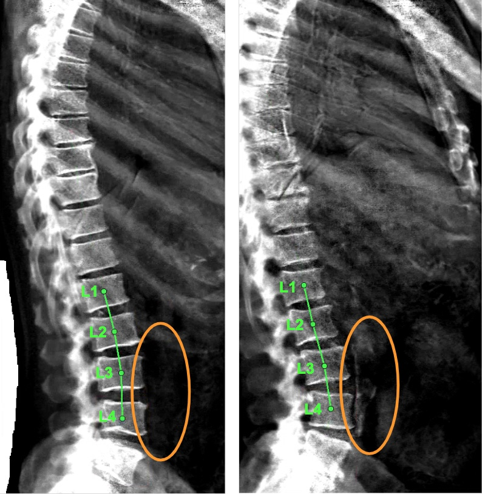
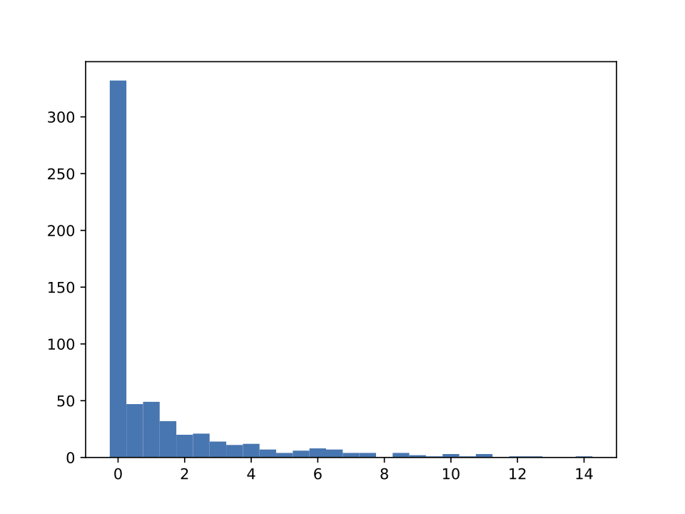
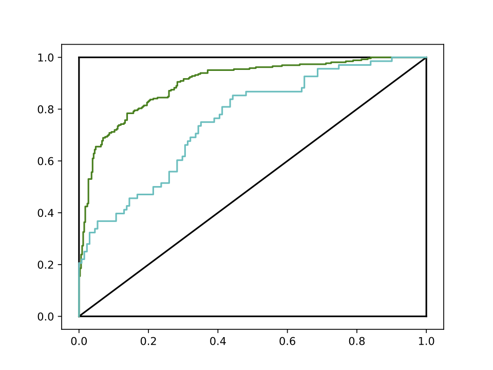
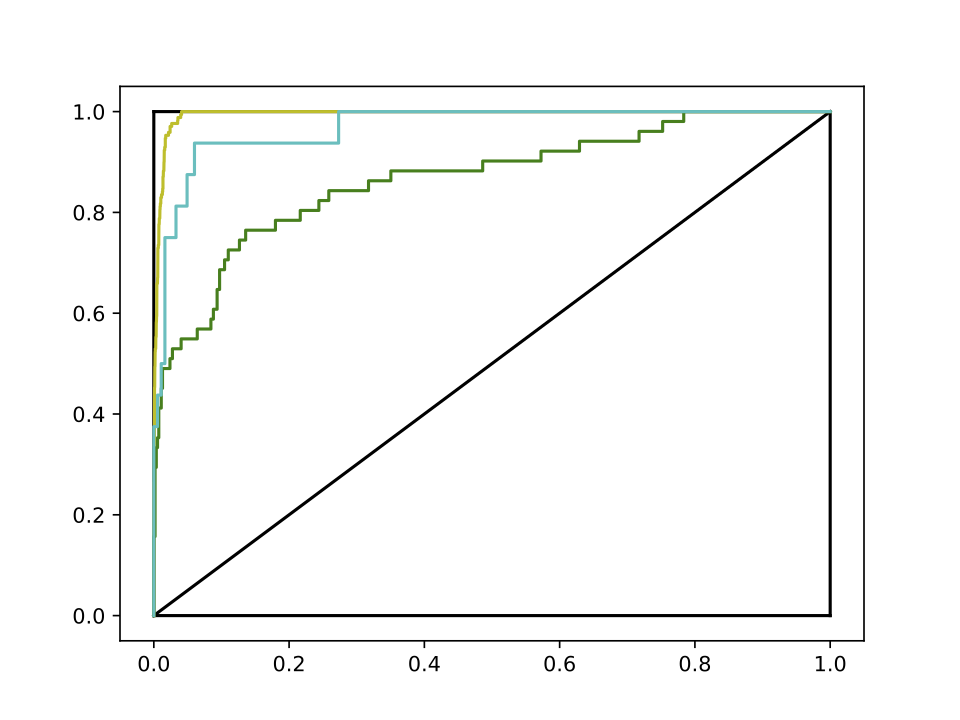
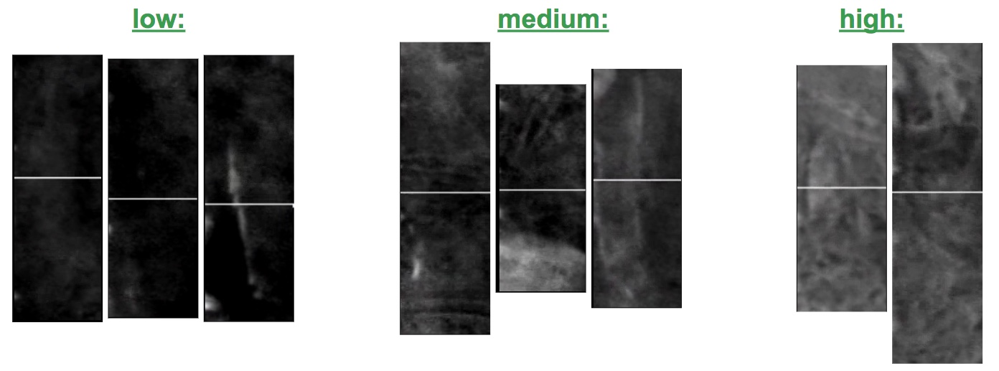
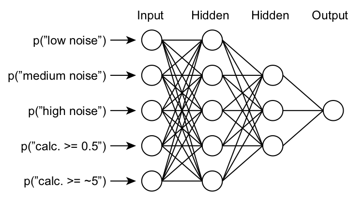
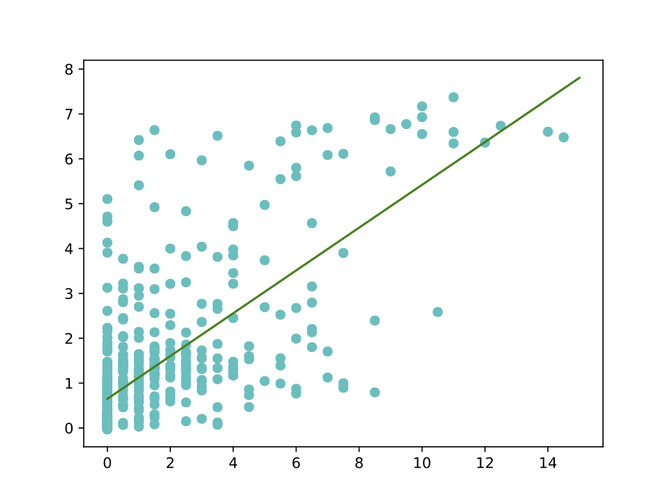
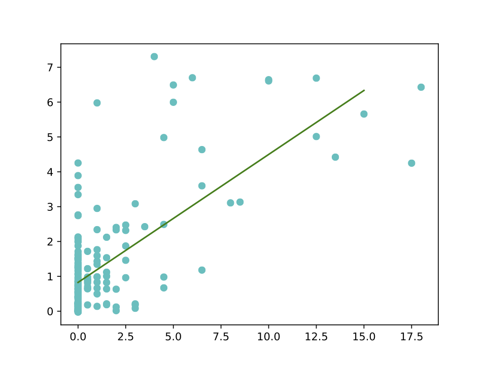
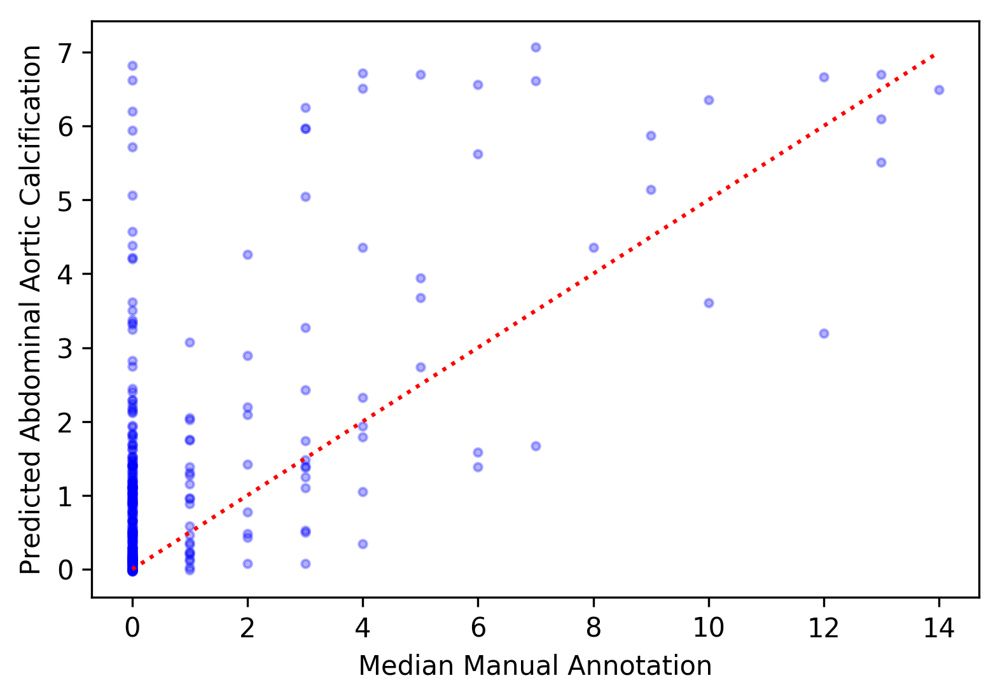

[Back to home.](../README.md)

# AAC Analysis: Methods Description

The pipeline described here seeks to score the degree
of abdominal aortic calcification through analysis of
a DEXA image.  The analysis occurs in three steps:
1. identification of the spine, and use of the labelled
   vertebrae to identify & extract the small region within
   the image that will contain the aorta;
2. classification of the aortic sub-image using three
   models (one classifying calcified-vs-not using a low
   threshold for calcification, another classifying the
   same using a high threshold for calcification, and
   a third classifying the extent of background noisiness
   in the image into low, medium, or high categories);
3. use of the scores assigned to each category by the above
   classification models to assign a calcification score.

## Step 1 Preamble: Image sizing.

The DEXA images used by Sethi et al were downloaded in three batches.  The
DEXA images were not all identical in size, but were similar in scale:
444.7(mean) +/- 27.4(SD) pixels wide and 940.0(mean) +/- 8.3(SD) pixels high.  The second
batch of images that I analyzed had a different distribution of dimensions:
755.1(mean) +/- 65.3(SD) pixels wide and 1665.9(mean) +/- 114.7(SD) pixels high.
The third batch of images was similar to the second: 781.5(mean) +/- 43.9(SD) pixels
wide and 1654.8(mean) +/- 104.5(SD) pixels high.

As I describe below, many of the models that I developed for spine analysis
were trained to evaluate markings that I added to images to identify the features
that were to be evaluated.  Since the dimensions of those markings were often hard-coded
(taking advantage, albeit short-sightedly, of the consistent scaling of the input data),
I was concerned that the large-scale rescaling between the image batches would ruin
model performance by pushing beyond the modest variability in scaling that all of the
models had been trained to tolerate.  I therefore re-scaled all of the second-batch and
third-batch images to 55% of their original size along each axis.

Since the height dimension was more-consistently scaled in the original image set
than the width dimension, the provided implementation of this pipeline will, by default, re-scale
each image uniformly along the width and hight axes such that the height axis will
be 940 pixels.  Command-line arguments are also available to either re-scale images that
were present in the Sethi et al data according to their rescaled dimensions in that study
(new images, as revealed by the ID's of the filenames, will still be rescaled to height==940),
or to forego any resizing of input images.  See the [get started](getstarted.md) documentation
for more details on how to invoke re-sizing options.

## Step 1: Isolation of the aorta via labelling of the spine.

The clinical scoring system for AAC, as described by deBie et al (BMC
Nephrology, 2017: 18:82), involves the assignment of points based on
the intensity with which the walls of the abdominal aorta can be visualized
in an x-ray image adjacent to the L1-L4 lumbar vertebrae.  Here, I attempted
to isolate the relevant portion of the DEXA image for such evaluation by first
mapping the spine and then capturing a smaller image adjacent to the L3 & L4
vertebrae.  For our study, DEXA images were available in bulk.  But they are
not ideally suited to the detection of AAC: high levels of background intensity
would often appear adjacent to the L1 & L2 vertebrae, often due to visualization
of the rib cage.  I therefore sought to isolate just the part of the image
adjacent to vertebrae L3 & L4.  That strategy is illustrated by the examples
below, with the lumbar vertebrae labelled in green and the desired aortic region
circled in orange (on the left, the aorta is invisible; on the right, calcification
allows it to be seen clearly):

This goal was achieved through two sequential processes, described on the linked pages:
1. [detection of the vertebrae](vert_detection.md);
2. [labelling of the L3 & L4 vertebrae and excision of the aorta](aorta_image.md).

For each input image (full DEXA scans), the end result of the analyses described in the
links above was a smaller image depicting the regions adjacent to the L3 vertebra (above
the white line) and the L4 vertebra (below the white line).  The inability to identify
both of those vertebrae resulted in no output aortic image.

## Step 2: Classification of calcification and noise in aorta images.

The overall distribution of AAC values is highly skewed towards little or no aortic
calcification.  This property was observable in the training set, with most rater-generated
scores at zero:

I developed two models, each described below, in order to address the problem of sparsity
of training data for high-calcification scores, I trained two models, each described below.
The first model focuses on the lower end of the distribution, and was trained to distinguish
between images with zero-value versus non-zero AAC scores.  The second focuses on the higher end
of the score distribution, where I used a more-efficient but less-precise-than-scoring method
to enrich a larger test data set for high-calcification images.

### Low-threshold aortic calcification:

For the training data, four raters scored calcification as an integer, and the median
value was taken of those four scores.  For this low-threshold AAC model, any image with
a rater-median score of 0.5 or greater was considered "calcified".  That approximately
split the training set (264 "calcified" images, 332 "non-calcified" images).  Here is
the ROC curve for that model (green = training set, blue = test set):

|     | Training set | Test set |
| --- | ------------ | -------- |
| Cohen's kappa | 0.5788 | 0.3298 |

### High-threshold aortic calcification:

For the purpose of helping to develop higher-threshold calcification models, the
human raters for the Sethi et al project designated a set of 5000 "sandbox" images that were
non-overlapping with the validation set, and were therefore of potential use to the
model developers as training data, but for which they would not provide manual ratings.
I used those data by iteratively appling a low-threshold model to those images, sorting
out the "calcified" images, then manually enriching those images for yet-higher calcification
values by selecting the apparently-more-calcified images from image pairs until I had
sufficient data to train another model.  I repeated this process until I had arrived at
a training set with 170 "calcified" and 4654 "non-calcified" images, at a threshold
that I estimated to be at approximately score=5.

For evaluation, the original training and test sets suffered from sparsity of high-scoring
data, making my evaluation of their performance sensitive to statistical noise.  Nonetheless,
these are the ROC curves and Cohen's kappa values for a) the actual, "sandbox"-enriched training
set (yellow); b) the original training set, with a score threshold of 5 (green), and c) the
original test set, again with a score threshold of 5 (blue):

|     | Training set ("sandbox") | Training set (original) | Test set |
| --- | ------------ | -------- | ------- |
| Cohen's kappa | 0.7105 | 0.5313 | 0.7281 |

### Background noise:

One observable confounding aspect of the images was the varying degree of "background"
noise that could be observed, defined as white coloration in the aortic region that
was not apparently specific to the aorta itself.  In order to help the ultimate
estimator model hopefully distinguish between true-positive calcification scores
driven by aorta-specific coloration and false-positive calcification scores driven
by non-specific coloration, I developed a "background noise" classification model,
classifying aortic images into groups based on "low", "medium", or "high" levels
of background noise:

The model I trained performed relatively poorly on test data, as shown below by the
confusion matrix and the Cohen's kappa value for my test set:

|      | low  | medium | high |
| ---- | ----:| ------:| ----:|
| **low** | 67 | 32 | 2 |
| **medium** | 14 | 70 | 5 |
| **high** | 0 | 1 | 8 |

**Cohen's kappa (test set) = 0.5142**

Despite its low information contribution, I hope that its orthogonality to the
true task (AAC scoring) but correlation with the returned values of the AAC
threshold models will allow this distracting property of the images to be taken
into account.

## Step 3: Scoring of aortic calcification using classification results.

For the final output value of the model (AAC score), I built and trained a small
regression model to input the probability scores from the classification models
above and output an AAC estimate.  For the binary classification tasks, I used
just one of the two outputs.  The structure of the model is shown below:

This model has 52 trainable parameters.  Prior to validation by the other authors
of Sethi et al (see "Validation set" below), I divided my training data into "training"
and "test" sets.  I experimented with many model structures and multiple attempts at
training the model described above, evaluating performance using the "test" set.
The statistics for the final model are shown below.  However, due to the repeated
use of the "test" set in optimizing the results, its similar performance to the
"training" set should not be considered as an appropriate evaluation of over-fitting:

| Training set | Test set |
| ------------ | -------- |
| Pearson r = 0.7042 | Pearson r = 0.7009 |
|  |  |
| x-axis: mean manual annotation; y-axis: computed score | x-axis: mean manual annotation; y-axis: computed score |

To more accurately assess model performance and over-fitting, Sethi used an additional
validation set that was truly independent of my training.  That validation is below:

| Validation set |
| -------------- |
| Pearson r = 0.6172 |
|  |

While the performance below was
not as good as for my training data, the performance was sufficient to contribute to
the analysis.  Performance was similar to that of an independently-developed method
[(Model 1)](https://github.com/calico/AAC_scoring/tree/master/model_1), and the two
methods were dissimlar enough that averaging their two outputs substantially increased
the predictive power versus either model individually.  See the Sethi et al manuscript
for a description of how those averaged scores from the two models were used to
address the epidemiology & genetics of abdominal aortic calcification.

