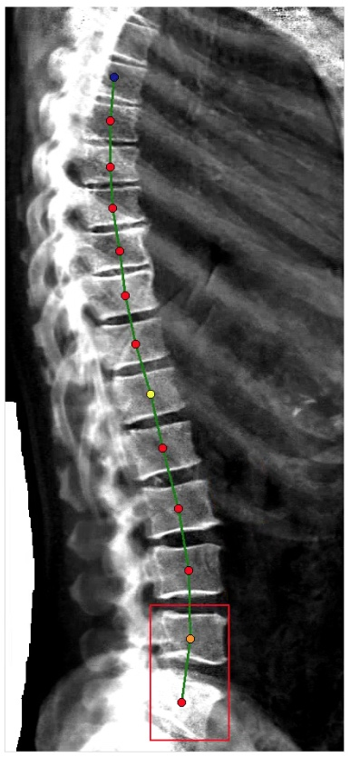
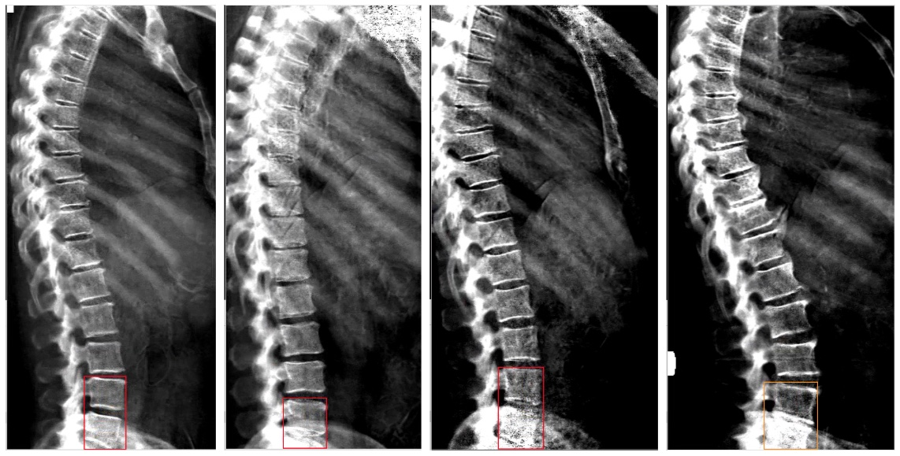
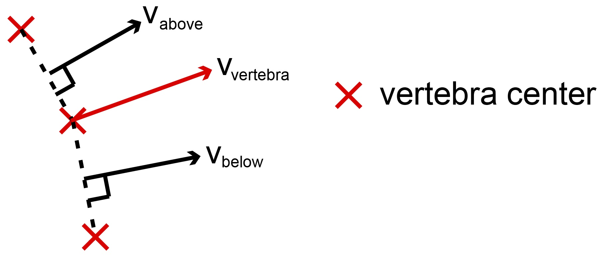
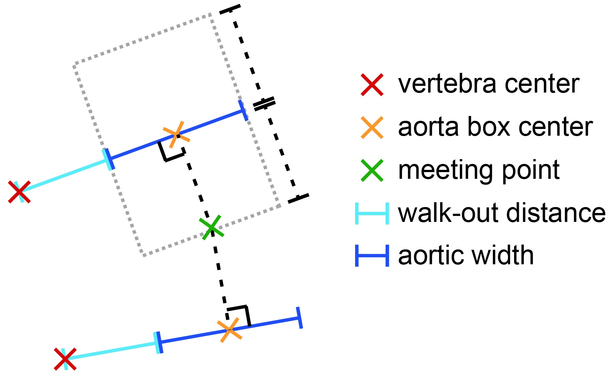
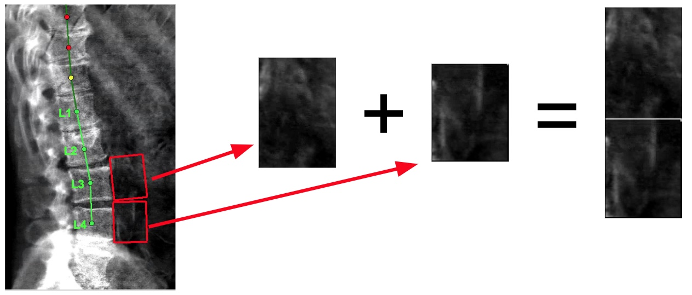

[Back to home.](../README.md)

[Back to AAC Analysis methods.](analysis.md)

# Extraction of the aortic image

With the vertebrae of the spine labelled as vertebrae, I sought to extract
the portion of the DEXA image containing the relatively-unobstructed aorta.
This meant the portion of the image adjacent to the L3 & L4 vertebrae.

Below, I describe the two steps of this process.  First, the labelling of
each vertebra based on its position relative to a box drawn by a L4+L5
object detector.  Second, extraction of the aortic image through geometrical
operations using the spine coordinates.

## Identification of the L3 & L4 vertebrae

Given an outline of the spine as illustrated below, it is straighforward to
determine which vertebra is which given a single reference point.  In these
DEXA images, the border between the L4 and L5 vertebrae was often coincident
with the top edge of a smear of light color corresponding to signal from the
pelvis:

An object-detection model was trained by transfer learning from the **ssd_mobilnet_v1**
model.  Examples of training data are shown below:

The best box returned by the model was used, irrespective of its score.  Performance:

| IoU for: |     |
| -------- | --- |
| Training set: | 0.893 |
| Test set: | 0.818 |

If no vertbra center coordinates overlapped the L4-L5 box, then analysis could
not proceed for that image.  Otherwise, the vertebra whose center coordinate
was closest to the center point of the top half of the L4-L5 box was labelled
as the L4 vertebra, and all other vertebra were labelled from that reference point
using their order along the Deming regression-derived spinal axis.

## Extraction of the aortic image

The aortic images were created by stacking rectangular images gathered from
adjacent to the L3 and L4 vertebrae, using the following four-step process:
1) definition of a vector pointing towards the aorta for each vertebra;
2) definition offset distances and image widths using the dimensions of the
   lumbar bounding boxes and aortic vectors;
3) definition of sub-image heights & extraction of the aortic sub-images
   adjacent to L3 and L4; and
4) rightening & stacking the L3- and L4-adjacent sub-images into a single output image.

### 1) Vectors to the aorta

As shown in the diagram below: for each vertebra, the segments connecting that
vertebra's center point to the center points of the flanking vertebrae were used
to define perpendicular vectors, pointing towards the aorta (*v_above* and *v_below*).
For the vertebra itself, a vector was defined whose origin was at the center of the
vertebra and whose direction *v_vertebra* was taken as the average of *v_above* and
*v_below*.  If the vertebra in question was at the end of the annotated spinal column,
then the direction of *v_vertebra* was set to equal that of whichever vector *v_above*
or *v_below* could be determined:

### 2) Determine dimensions

All dimensions used for the generation of aorta images were determined in reference
to the sizes of bounding boxes drawn around the vertebrae.  The reference unit *b* is
defined as the average width of boxes drawn for the first four lumbar vertebrae (L1-L4).
Since bounding-boxes are drawn with absolutely horizontal & vertical sides, they would
over-estimate the width of the vertebra itself to an increasing degree as the angle of
the spine diverged from absolute vertical.  The widths used to calculate *b* were therefore
scaled down by using the cosine of the angle by which *v_vertebra* as defined above differed
from absolute horizontal:

*b* = mean(*b_L* for *L* in [L1,L2,L3,L4])

*b_L* = [box width for vertebra *L*] X cosine(*v_L* - horizontal)

Two dimensions were derived from *b*.  First, the distance between the center of the
vertebra and the nearest edge of the aorta image (the "walk-out distance", *d*) was
calculated as half of *b*.  Second, the width of the aortic image ("aortic width", *a*)
was calculated as three-quarters of *b*.  These values were selected heuristically:

*a* = *b* X 0.5

*d* = *b* X 0.75

### 3) Extraction of aortic image

For each vertebra L3 and L4, an image of the adjacent aorta was extracted using the parameters
calculated above as illustrated in the diagram below:

From each relevant vertebra center (red X), the distance *d* (walk-out distance; light blue)
was travelled in the direction of *v_vertebra* to determine the left side of the image, then
extended the distance *a* (aortic width; dark blue) to determine the right side of the image.
The vertical stretch of the image in each direction was determined by calculating a line that
was perpendicular to *v_vertebra* (dotted black lines) and intersected the midpoint of the "aortic width" segment
(orange X's).  For the image in the diagram, the bottom edge is determined by the point at which
that line from the upper vertebra intersects the equivalent from the lower vertebra (green X).
If vertebrae were not annotated in both directions, then the missing distance was set equal to
the found distance, e.g. in the diagram, the "above" vertebra is missing, so the upwards dimension
of the aortic image is set equal to the downwards dimension defined using the "below" vertebra.
The dotted gray box represents the area that was then extracted from the image.

### 4) Stacking of aortic images into output image

As illustrated below: the two aortic images were stacked, L3 on top of L4, to produce the output
image for analysis:

