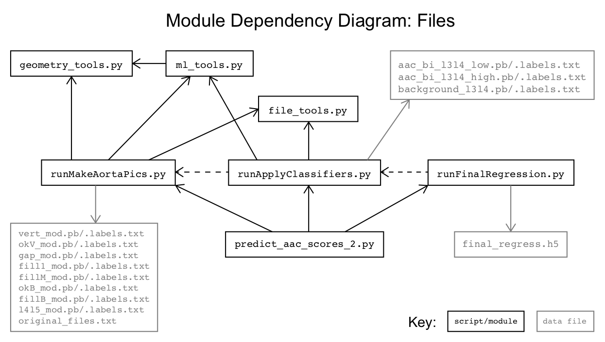
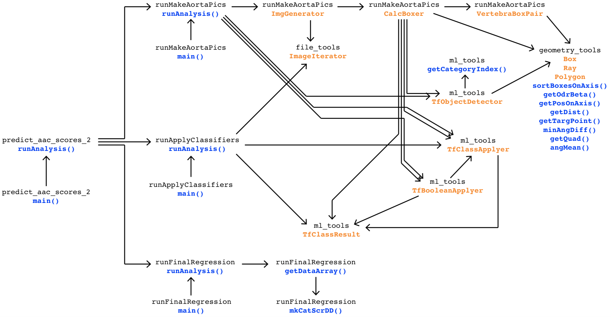

[Back to home.](../README.md)

# Developer Documentation

## Script & Module Organization

This pipeline was developed as three separate steps, as described by
the [methods](analysis.md) documentation: 1) a step for extraction of
an aortic sub-region; 2) a step for classification of the aortic image
by different criteria - this was originally intended to be the final
analysis step, but lack of success with many experimental models led
me to synthesize them in a third step; 3) the combination of categorical
model probabilities into a single regression output value (AAC prediction).

The overall structure of this system reflects that historical development,
with the three separate steps implemented as three separate, independently-runnable
scripts: 1) `runMakeAortaPics.py`, 2) `runApplyClassifiers.py`, and 3) `runFinalRegression.py`.
These scripts have maintained their independent call-ability, but in this overall system
they are used as modules, iteratively executed by a single call from `predict_aac_scores_2.py`.
Here is a module dependency diagram (MDD) showing the dependencies between the FILES that are provided
with this system:

## Support data files

In addition to the source code that executes this analysis, a number of
source data files are required by this system (depicted in gray in the MDD above).
For the most part, these are tensorflow saved-model files (`.pb`) with accompanying
label files (`.labels.txt`).  These represent the ML models that were developed
for this analysis pipeline; their various roles & performances are described in
the [methods](analysis.md) documentation.  In one case, the ML model was saved and is
provided as a keras model file (`.h5`).

Finally, the original application of this
system to data for Sethi et al (REF) included some manually-executed resizing of images in batches.
By default, this system executes an image-by-image resizing to achieve the intended goal
of those manual re-sizing efforts on new (or old) data.  However, that method will not
recover identical results for the original data as was used by Sethi et al for downstream
analysis.  To allow users to re-generate those data exactly, an additional data file
(`original_files.txt`) specifies, for each ID-named file from the original data set,
the original re-sizing batch to which the image belonged.  See the [methods](analysis.md)
documentation for more information on the resizing strategy & justification and the
[get started](getstarted.md) documentation for information on how to invoke the original
resizing on old images.

In the table below, each data file is listed and described in terms of when and why/how
it is applied.  "Steps" are numbered according to the analysis step by which each file
is used (as described above: step 1 is executed by `runMakeAortaPics.py`,
step 2 is executed by `runApplyClassifiers.py`, and
step 3 is executed by `runFinalRegression.py`).

| File                     | Step | Purpose       |
| ------------------------ |:----:| ------------- |
| vert_mod.pb/.labels.txt  | 1 | Initial object detection of vertebrae. |
| okV_mod.pb/.labels.txt   | 1 | QC: is this an appropriately-labelled vertebra? |
| gap_mod.pb/.labels.txt   | 1 | QC: are these two adjacent vertebrae actually adjacent? |
| fill1_mod.pb/.labels.txt | 1 | Object detection of a single missing vertebra. |
| fillM_mod.pb/.labels.txt | 1 | Object detection of the vertebrae at either end of a multi-vertebra gap. |
| okB_mod.pb/.labels.txt   | 1 | QC: is this vertebra at the bottom of the spinal column? |
| fillB_mod.pb/.labels.txt | 1 | Object detection of the vertebra below the bottom-most labelled. |
| l4l5_mod.pb/.labels.txt  | 1 | Object detection of the L4-L5 vertebra pair. |
| original_files.txt       | 1 | A list of all images analyzed by Sethi et al, indicating their batch. |
| aac_bi_l3l4_low.pb/.labels.txt  | 2 | Classification of calc/nocalc with a low threshold. |
| aac_bi_l3l4_high.pb/.labels.txt | 2 | Classification of calc/nocalc with a high threshold. |
| background_l3l4.pb/.labels.txt  | 2 | Classification of the background noise level. |
| final_regression.h5 | 3 | Regression model using the scores output by the classification models.|

## Classes and functions

The following module dependency diagram indicates the dependency chains for all functions
and classes in this system.  Note that internal dependencies within `geometry_tools` are
not shown, but rather are treated as a single modular entity:

The three analysis steps `runMakeAortaPics`, `runApplyClassifiers`, and `runFinalRegression`
are largely independent of one another, and each can be run through its own programmatic
interface `runAnalysis()` method.  The first two steps (`runMakeAortaPics` and `runApplyClassifiers`)
rely on a common set of directory-parsing and tensorflow-application tools, found in the `file_tools` and
`ml_tools` modules.

Additional documentation is found within the code itself.