[Back to home.](../README.md)

[Back to AAC Analysis methods.](analysis.md)

# Detection of the vertebrae

The foundation of this AAC analysis system is the annotation of the spine and
its constituent vertebrae in the DEXA image.  That annotation defines the landmarks
that are used to isolate the portion of the image that contains the aorta, a
task that cannot be performed independently of these landmarks because the aorta
is only clearly visible in these images when it is extensively calcified.

This page describes the steps taken to annotate as many individual vertebrae
as possible while minimizing the false-positive annotation of other parts of
the image as vertebrae.  This task was initially approached with a simple
object-detection model.  However, working alone on annotation, I was unable
to generate a training set of sufficient size for the models I generated to
avoid what seemed to me to be obvious mistakes.  Rather than continue to annotate
training data indefinitely, I chose to implement a series of analyses & models
to detect & correct errors.  The end product is an analysis pipeline that is
summarized in the diagram below:

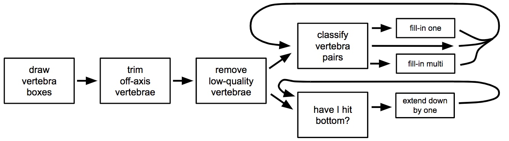

Initially, vertebrae are boxed using an object-detection model that is applied
with a very low score threshold (**"draw vertebra boxes"**; few false negatives, many
false positives). Incorrect annotations that are far from the spine are easily
detected and removed using the unusual vertebra-to-vertebra angles that are produced
(**"trim off-axis vertebrae"**).  Each remaining vertebra is then scrutinized by a
classification model that is trained using high-quality versus low-quality annotations
that were produced by the initial object-detection model, i.e. a model to specifically
address the first model's errors (**"remove low-quality vertebrae"**).  Then, missing
vertebrae (either missed initially or removed because they were poorly defined) are
detected and filled in, using the context of the nearby annotations to increase
sensitivity and specificity versus the initial object-detection model.  In the first
case, skipped vertebrae are detected (**"clasify vertebra pairs"**) and filled in
by a model appropriate to the number of consecutive vertebrae that were missed
(**"fill-in one"** or **"fill-in multi"**).  In the second case, missing vertebrae
at the bottom of the spine are detected (**"have I hit bottom?"**) and filled in
(**"extend down by one"**).  Each step is described below.

## Vertebra object detector

An object detector was trained using transfer learning from the
**ssd_mobilnet_v1** model using annotations similar to those below:

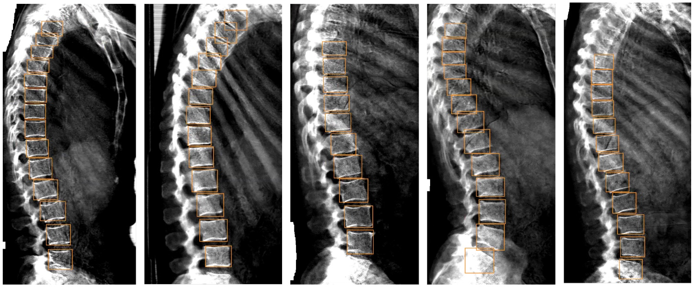

Performance was evaluated by intersection-over-union (IoU), setting
a threshold score for detected objects at 0.1:

| IoU for: |     |
| -------- | --- |
| Training set: | 0.891 |
| Test set: | 0.759 |

## Spine angle filter

The curve of the human spine is sufficiently genlte that the angle of a vector
connecting two adjacent vertebrae was generally the same as the angles of
vectors connecting flanking pairs of vertebrae (highlighted by green arrows
in the sample images below).  However, many false-positive detections of
vertebrae occurred off the approximate line of the spinal column, producing
large differences between the angles of adjacent-vertebra-connecting vectors
(highlighted by red arrows in the sample images below).  That property was
used to identify & eliminate false-positive vertebra annotations:

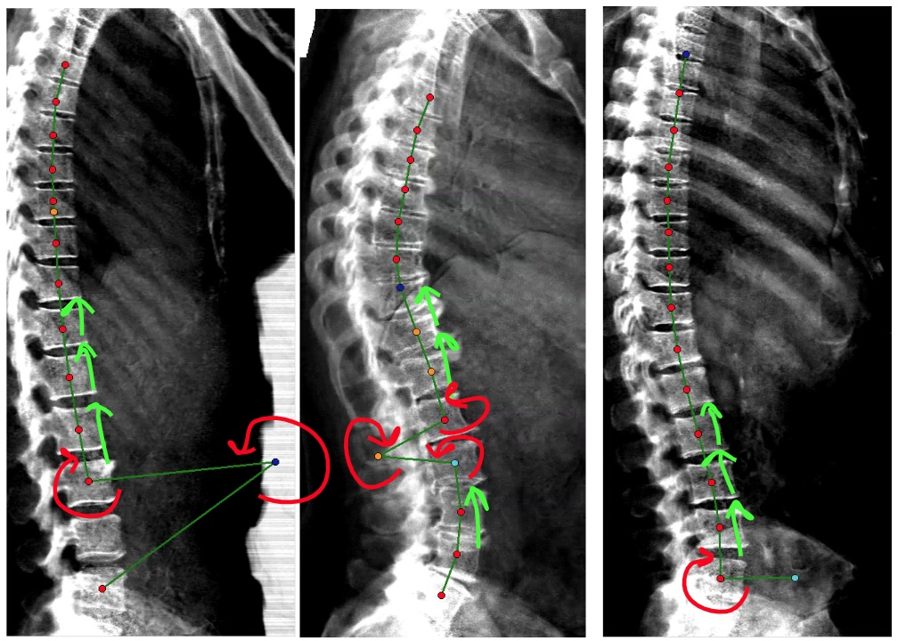

For this analysis, each vertebra was considered as a point, defined by the
center of the bounding box defined by the vertebra object detector (above).
An axis along which vertebrae would be sorted was defined using a Deming
regression across those points, and vertebrae were sorted along that axis.
Angle analysis could then be performed across the vectors connecting adjacent
vertebrae in that sorted array (the lines connecting center-point dots in the
sample images above).

For adjacent vertebra-pair vectors, angle differences greater than 45 degrees
led to removal of a vertebra.  Iteratively, the largest angle difference was
identified until either that angle was less than 45 degrees.  As illustrated
in the two left-most examples in the image above: for an internal off-axis
vertebra, the largest pair-to-pair vector-angle difference will be before versus
after the offending vertebra, so that vertebra was removed.  For the first
or last angles of the spinal column (illustrated in the right-most example in the
image above), the elimination of the first- versus the second-from-the-end
vertebra was compared, and the choince that produced greater coherence with the
next vector angle was selected.

## Elimination of bad vertebrae

For each vertebra detected from a series of DEXA images, I created a small image
extending 60 pixels up/down and left/right from the center point of the
detection box (or the edges of the image).  To provide the model with a visual
reference, I drew a small green circle at the center of the annotation box.
I then classified whether or not the circle was correctly ("ok") or incorrectly
("bad") placed at the approximate center of a legitimate vertebra:

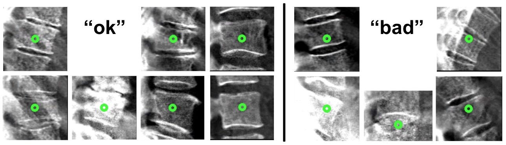

A classification model was trained using transfer learning from the **inception_v3**
model.  Below are a ROC curve and Cohen's kappa values for its performance on the
training set (green) and test set (blue):

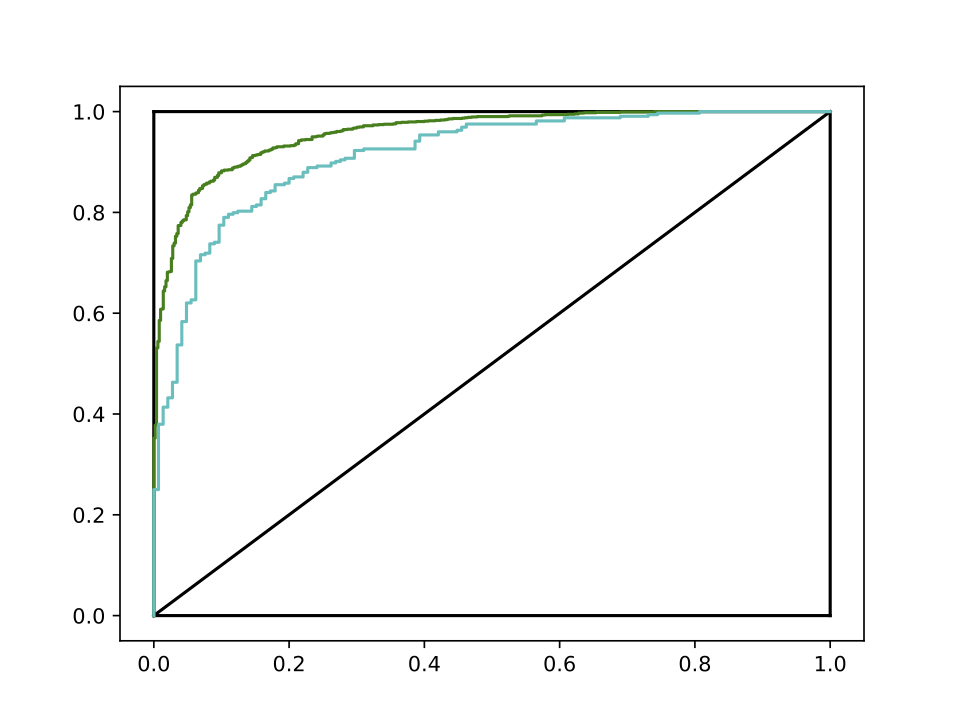

| Cohen's kappa for:       | |
| ------------------------ | ---- |
| Training set | 0.743 |
| Test set     | 0.638 |

## Detection & insertion of skipped vertebrae

With off-spine and poorly-annotated vertebrae eliminated, many gaps were left
in the spinal column.  I sought to fill in those gaps using object-detection.
Contrary to the initial object-detector model: in this case, I had strong
expectations for where new vertebrae should be annotated based on the context
provided by the high-quality existing annotations.  I sought to take advantage
of those expectations by training object-detection models that specifically take
advantage of the pre-existing annotatons.

Annotation problems were first identified through analysis of pairs of adjacent
vertebra annotations in the currently-annotated spinal column.  Assuming that
bogus annotations had been eliminated by the steps above, a pair of adjacent
vertebrae could either be 1) truly adjacent in the spinal column; 2) separated by
a single un-annotated vertebra; 3) separated by multiple un-annotated vertebrae;
or 4) redundant annotations of a single vertebra.  Those cases are illustrated below,
with a green line connecting the centers of the "adjacent" vertebra annoations, and
with a red circle drawn that is centered on the center of each vertebra of the pair:

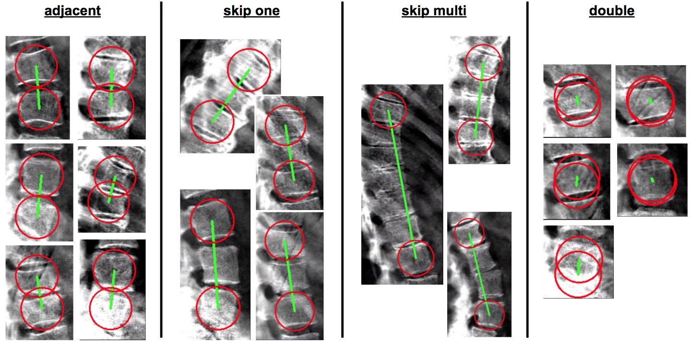

In order to identify these cases, for each vertebra pair in the current annotation
set, a sub-image of those two vertebrae was extracted and marked as in the examples
above.  A classification model for these images
was trained using transfer learning from the **inception_v3**
model.  Initial classification of training-set "observed" pairs generated a
paucity of cases for the "skip one" (7.0%), "skip multi" (4.7%), and especially
"double" (1.4%) cases.  I enriched each of those classes for training by manually
generating such errors in training images (**"supplemented training set"**: 13.1%
"skip one", 9.7% "skip multi", 6.0% "double") and trained using that enriched set.
The test set reflected the true (non-enriched) distribution (7.4% "skip one",
4.0% "skip multi", 1.1% "double").

Below are Cohen's kappa values for its performance on the
training set, the supplemented triaingin set, and the test set:

| Cohen's kappa for:       | |
| ------------------------ | ---- |
| Initial training set      | 0.876 |
| Supplemented training set | 0.903 |
| Test set                  | 0.807 |

And a confusion matrix for the test set:

|     | adjacent | skip one | skip multi | double |
| --- | --------:| --------:| ----------:| ------:|
| **adjacent**   | 982 | 2 | 2 | 14 |
| **skip one**   | 11 | 61 | 12 | 0 |
| **skip multi** | 0 | 0 | 46 | 0 |
| **double**     | 9 | 0 | 0 | 4 |

As described below, distinct actions were taken for each of the three error modes
that could be detected by this model ("skip one", "skip multi", or "double).
This error-detection-then-correction procedure was repeated across the entire
spine until either no changes were made or four cycles of refinement had been
performed, whichever came first.

### Action taken for doubly-labelled vertebrae ("double")

For pairs of adjacent vertebra annotations that were classified
as representing duplicate annotations of a single vertebra, the
better annotation was retained and the worse annotation was
culled.  Better/worse was defined using the scores from the
annotation-quality model described in the "Elimination
of bad vertebrae" section, above.

### Action taken for single skipped vertebrae ("skip one")

An object-detection model was trained by transfer learning from the **ssd_mobilnet_v1**
model, using the marked-up sub-images that were sorted by the classification model.
Only the unnanotated vertebra was annotated for detection here.
Examples of training data are show below:

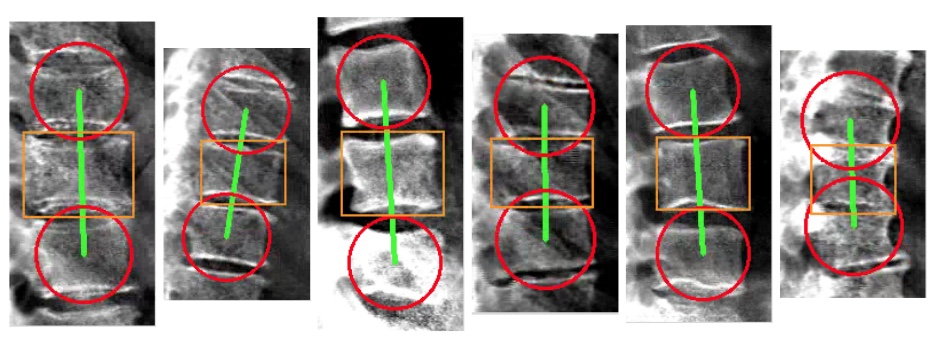

Only the single best object identified by the model was kept, and only if it was
reported with a confidence score of at least 0.5.  Performance:

| IoU for: |     |
| -------- | --- |
| Training set: | 0.894 |
| Test set: | 0.865 |

### Action taken for multiple skipped vertebrae ("skip multi")

An object-detection model was trained by transfer learning from the **ssd_mobilnet_v1**
model, again using the marked-up sub-images that were sorted by the classification model.
Only the two unnanotated vertebrae flanking the outer, marked vertebrae were annotated for
detection here.  If the gap in annotations along the spine was greater than two vertebrae,
then multiple rounds of refinement were required to close it.  Examples of training data
are shown below:

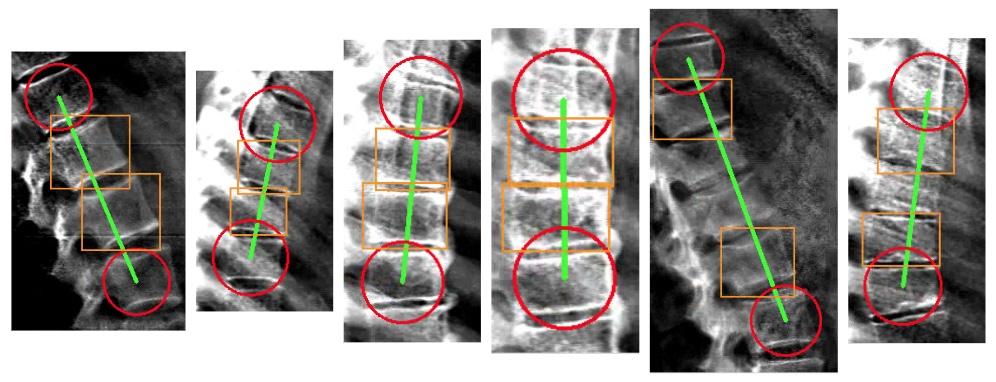

Only the two best objects identified by the model were kept, and only if they were
reported with confidence scores of at least 0.5.  Performance:

| IoU for: |     |
| -------- | --- |
| Training set: | 0.802 |
| Test set: | 0.695 |

The inferior performance of this model can be attributed to the extra difficulty of this
task: it was unlikely that many vertebrae would be skipped in a row in an easy-to-interpret
image (or area within an image).

## Extending the bottom of the spinal column

A separate pair of models was developed to detect & repair missing vertebrae from the bottom
of the spinal column.  The procedure described below was applied iteratively, up to six times,
until either the classification model determined that the bottom of the spine/image had been reached,
an annotation arose that could be classified as the L4 vertebra, or no change was made through an
iteration.

For determining whether the bottom of the spine or image had been reached, sub-images of the
bottom-most vertebra, marked with a red circle and green dot at its center, and extending down
to the bottom of the full DEXA image were extracted.  An image classification model was trained
using transfer learning from the **inception_v3** model to classify these images as either "ok"
(if the bottom had been reached) or "missing" (if vertebrae remained to be annotated):

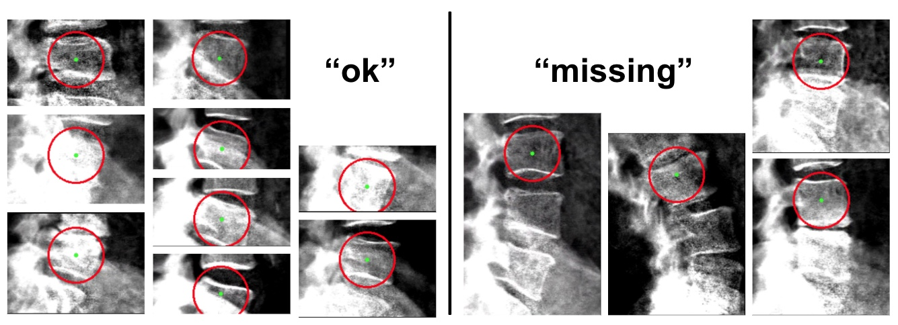

Below are a ROC curve and Cohen's kappa values for this model's performance on the
training set (green) and test set (blue):

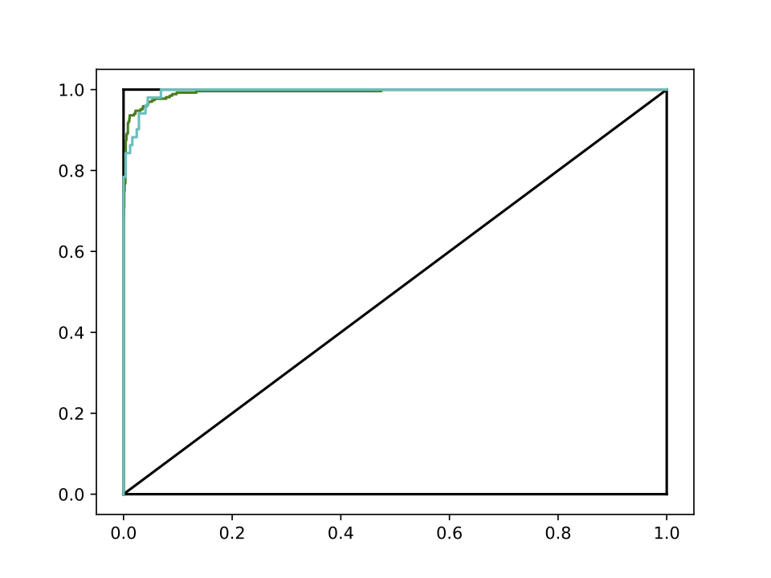

| Cohen's kappa for:       | |
| ------------------------ | ---- |
| Training set | 0.917 |
| Test set     | 0.874 |

If the marked-up sub-image was classified as "missing", then an object-detection model was
applied to detect the next vertebra down the spine.  This model was trained by transfer 
learning from the **ssd_mobilnet_v1** model, using the marked-up sub-images from the classification
step.  Only the single vertebra immediately below the marked (previously bottom-most) vertebra 
was annotated for detection here.  Examples of training data are show below:

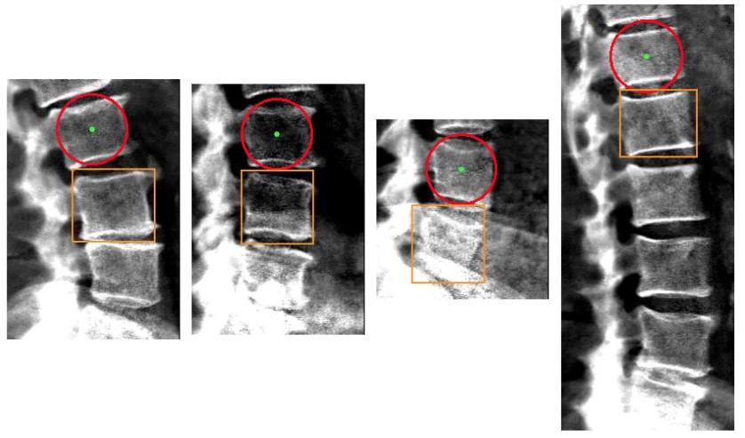

Only the single best object identified by the model was kept, and only if it was
reported with a confidence score of at least 0.5.  Performance:

| IoU for: |     |
| -------- | --- |
| Training set: | 0.898 |
| Test set: | 0.855 |

